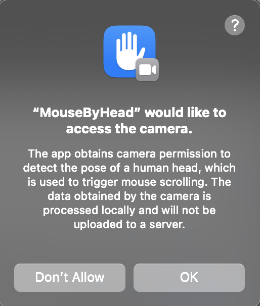

## 背景介绍

**久坐，背痛，脖子痛怎么办**？

大部分长期对着电脑工作的朋友都可能遇到这样的问题

如果能在浏览网页的时候，通过低头抬头来控制鼠标滚动，就可以缓解僵硬的脖子了。

同时还可以用如下姿势，缓解含胸驼背带来的苦痛。

## App 介绍

这是一个 mac app， 让你在浏览网页的时候，通过低头抬头来控制鼠标滚动，可以缓解僵硬的脖子。

### 安装

[AppStore 下载](https://apps.apple.com/us/app/mousebyhead/id6745446925)

### 首次启动 app

1. 授权 Camera
2. 授权 app 控制电脑
3. 重启 App

### 日常使用

1. 鼠标要点到浏览器等窗口内，鼠标滚动事件才起作用
2. 左歪头禁止 App 触发鼠标滚动 ，右歪头允许 App 触发鼠标滚动
3. 抬头和低头滚动网页

## 演示视频

[B 站 MouseByHead 演示视频](https://www.bilibili.com/video/BV1fwVAzREFr/)

## 为什么要自己写一个 app

1. 代码开源，不会泄漏人脸数据
2. 其他类似功能的软件要收费

## 环境信息

MacOS 12.0+，Xcode15.2+,SwiftUI

## App 权限开启

开启 Camera 权限

在系统设置的“隐私与安全”中的“辅助功能” 允许 app 控制您的电脑

3. 重启 App

## 价值主张

减少一分肉体上的痛苦，换得一分平和心境

## 打赏

