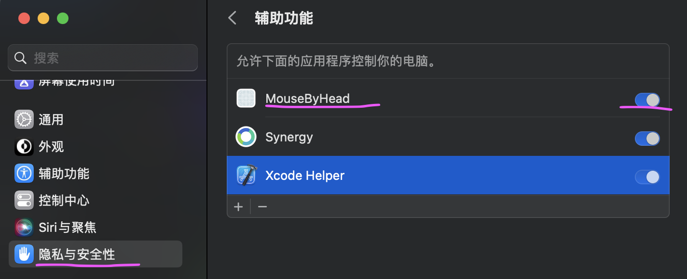

## 背景介绍

**久坐，背痛，脖子痛怎么办**？

大部分长期对着电脑工作的朋友都可能遇到这样的问题

如果能在浏览网页的时候，通过低头抬头来控制鼠标滚动，就可以缓解僵硬的脖子了。

同时还可以用如下姿势，缓解含胸驼背带来的苦痛。

## 为什么要自己写一个 app

- 代码开源，不会泄漏人脸数据
- 其他类似功能的软件要收费

## 演示视频

[bilibili](https://www.bilibili.com/video/BV1fwVAzREFr/)

## 安装环境

macOS 12.0+

## App 权限开启

需要在系统设置的“隐私与安全”中的“辅助功能” 允许 app 控制您的电脑

## 开发环境

xcode15.2+,swiftui

## 价值主张

减少一分肉体上的痛苦，换得一分平和心境
